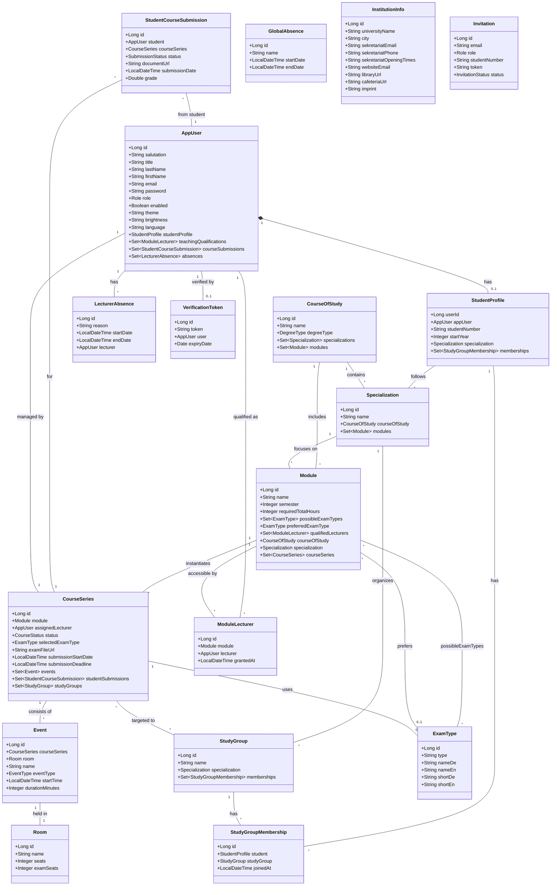

# Architektur-Dokumentation: Campus Plattform JPA-Entitäten

Diese Dokumentation beschreibt die Struktur und das Zusammenspiel der JPA-Entitäten der Campus-Plattform. Sie dient als Leitfaden für Entwickler, um die Beziehungen zwischen Studenten, Dozenten, Modulen und Veranstaltungen zu verstehen.

## 1. Kern-Domain: Benutzer & Gruppen

Die Plattform unterscheidet zwischen administrativen Daten, Lehrinhalten und der konkreten Ausführung von Kursen.

### AppUser (Tabelle: `app_user`)
Zentrale Entität für alle Personen im System.
- **Eigenschaften**: `id`, `salutation`, `title`, `lastName`, `firstName`, `email`, `password`, `role` (Enum `Role`), `enabled`.
- **UI-Präferenzen**: `theme`, `brightness`, `language`.
- **Beziehungen**:
    - `studentProfile`: `@OneToOne` zu `StudentProfile` (mapped by `appUser`).
    - `teachingQualifications`: `@OneToMany` zu `ModuleLecturer` (Lehrbefähigungen).
    - `courseSubmissions`: `@OneToMany` zu `StudentCourseSubmission` (Prüfungsleistungen).
    - `absences`: `@OneToMany` zu `LecturerAbsence` (individuelle Fehlzeiten).

### StudentProfile (Tabelle: `student_profile`)
Zusatzdaten für Studenten, verknüpft via Shared Primary Key (`user_id`).
- **Eigenschaften**: `userId` (PK), `studentNumber` (unique), `startYear`.
- **Beziehungen**:
    - `appUser`: `@OneToOne` zurück zu `AppUser`.
    - `specialization`: `@ManyToOne` zur fachlichen Vertiefung.
    - `memberships`: `@OneToMany` zu `StudyGroupMembership`.

### StudyGroup (Tabelle: `study_group`)
Repräsentiert studentische Kohorten (z.B. "Informatik 2023").
- **Eigenschaften**: `id`, `name`.
- **Beziehungen**:
    - `specialization`: `@ManyToOne` (Pflicht) zur fachlichen Vertiefung.
    - `memberships`: `@OneToMany` zu `StudyGroupMembership`.
    - `courseSeries`: `@ManyToMany` (via `course_series_study_group`) zu den belegten Kursen.

### StudyGroupMembership (Tabelle: `study_group_membership`)
Join-Entität zwischen `StudentProfile` und `StudyGroup`.
- **Eigenschaften**: `id`, `joinedAt` (Zeitpunkt des Beitritts).
- **Beziehungen**:
    - `student`: `@ManyToOne` zu `StudentProfile`.
    - `studyGroup`: `@ManyToOne` zu `StudyGroup`.

## 2. Akademische Struktur (Studiengänge, Vertiefungen & Module)

### CourseOfStudy (Tabelle: `course_of_study`)
Repräsentiert einen gesamten Studiengang.
- **Eigenschaften**: `id`, `name`, `degreeType` (Enum `DegreeType`: BACHELOR, MASTER).
- **Beziehungen**:
    - `specializations`: `@OneToMany` zu den Vertiefungsrichtungen.
    - `modules`: `@OneToMany` zu den enthaltenen Modulen.

### Specialization (Tabelle: `specialization`)
Eine fachliche Vertiefung innerhalb eines Studiengangs.
- **Eigenschaften**: `id`, `name`.
- **Beziehungen**:
    - `courseOfStudy`: `@ManyToOne` zum Studiengang.
    - `modules`: `@OneToMany` zu den spezialisierungsspezifischen Modulen.

### Module (Tabelle: `module`)
Die fachliche Definition einer Lehrveranstaltung.
- **Eigenschaften**: `id`, `name`, `semester`, `requiredTotalHours`.
- **Beziehungen**:
    - `possibleExamTypes`: `@ManyToMany` (via `module_exam_types`) zu `ExamType`.
    - `preferredExamType`: `@ManyToOne` zu `ExamType` (Standard-Empfehlung).
    - `courseOfStudy`: `@ManyToOne` (Pflicht) zum zugehörigen Studiengang.
    - `specialization`: `@ManyToOne` zur optionalen Vertiefung.
    - `qualifiedLecturers`: `@OneToMany` zu `ModuleLecturer`.
    - `courseSeries`: `@OneToMany` zu den Durchläufen.

### ModuleLecturer (Tabelle: `module_lecturer`)
Join-Entität für die Lehrbefähigung der Dozenten.
- **Eigenschaften**: `id`, `grantedAt` (Zeitpunkt der Erteilung).
- **Beziehungen**:
    - `module`: `@ManyToOne` zum Modul.
    - `lecturer`: `@ManyToOne` zum Dozenten (`AppUser`).

### ExamType (Tabelle: `exam_type`)
Definiert die Arten der Prüfungen (Klausur, Hausarbeit, etc.).
- **Eigenschaften**: `id`, `type`, `nameDe`, `nameEn`, `shortDe`, `shortEn`.

## 3. Kursplanung & Ausführung (CourseSeries)

### CourseSeries (Tabelle: `course_series`)
Die konkrete Instanziierung eines Moduls in einem Semester.
- **Eigenschaften**: `id`, `status` (Enum `CourseStatus`), `examFileUrl`, `submissionStartDate`, `submissionDeadline`.
- **Beziehungen**:
    - `module`: `@ManyToOne` (Pflicht) zum übergeordneten Modul.
    - `assignedLecturer`: `@ManyToOne` (Pflicht) zum leitenden Dozenten (`AppUser`).
    - `selectedExamType`: `@ManyToOne` zur gewählten Prüfungsform.
    - `events`: `@OneToMany` zu Einzelterminen.
    - `studentSubmissions`: `@OneToMany` zu den studentischen Leistungen.
    - `studyGroups`: `@ManyToMany` (via `course_series_study_group`) zur Zielgruppe/Kohorte.

### Event (Tabelle: `event`)
Ein konkreter Kalender- oder Stundenplaneintrag.
- **Eigenschaften**: `id`, `name`, `eventType` (Enum `EventType`), `startTime`, `durationMinutes`.
- **Beziehungen**:
    - `courseSeries`: `@ManyToOne` zum Kursdurchlauf.
    - `room`: `@ManyToOne` zum Veranstaltungsort.

## 4. Prüfungs- und Leistungserfassung (Submissions)

### StudentCourseSubmission (Tabelle: `student_course_submission`)
Die Verknüpfung von Studenten-Leistungen mit einem Kursdurchlauf.
- **Eigenschaften**: `id`, `status` (Enum `SubmissionStatus`), `grade`, `documentUrl`, `submissionDate`.
- **Beziehungen**:
    - `student`: `@ManyToOne` zum leistenden Studenten (`AppUser`).
    - `courseSeries`: `@ManyToOne` zum Kursdurchlauf.

## 5. Abwesenheiten, Räume & Infrastruktur

### Room (Tabelle: `room`)
Physische Räumlichkeiten der Universität.
- **Eigenschaften**: `id`, `name`, `seats`, `examSeats`.

### GlobalAbsence (Tabelle: `global_absence`)
Systemweite Sperrzeiten (z.B. Feiertage).
- **Eigenschaften**: `id`, `name`, `startDate`, `endDate`.

### LecturerAbsence (Tabelle: `lecturer_absence`)
Individuelle Abwesenheiten von Lehrenden.
- **Eigenschaften**: `id`, `reason`, `startDate`, `endDate`.
- **Beziehungen**:
    - `lecturer`: `@ManyToOne` zum entsprechenden `AppUser`.

### InstitutionInfo (Tabelle: `institution_info`)
Stammdaten der Universität.
- **Eigenschaften**: `id`, `universityName`, `city`, `sekretariatEmail`, `sekretariatPhone`, `sekretariatOpeningTimes`, `websiteEmail`, `bibliothekUrl`, `mensaUrl`, `impressum`.

### Invitation (Tabelle: `invitation`)
Einladungs-Tokens für neue Benutzer.
- **Eigenschaften**: `id`, `email`, `role`, `studentNumber`, `token`, `status` (Enum `InvitationStatus`).

### VerificationToken (Tabelle: `verification_token`)
Sicherheits-Tokens.
- **Eigenschaften**: `id`, `token`, `expiryDate` (Date).
- **Beziehungen**:
    - `user`: `@OneToOne` (Pflicht) zum betroffenen `AppUser`.

## 6. Datenmodell-Übersicht (UML)

---

### Entwickler-Hinweise:
1. **Kein ManyToMany** (Ausnahme: `Module.possibleExamTypes` und `CourseSeries.studyGroups`): Standardmäßig sollten neue Beziehungen über explizite Join-Tabellen/Entitäten (wie `ModuleLecturer`) gelöst werden, um Metadaten hinzufügen zu können.
2. **Cascade-Rules**: Löschvorgänge bei `AppUser` oder `Module` kaskadieren standardmäßig (`CascadeType.ALL`) auf ihre Join-Tabellen-Einträge, um Datenleichen zu vermeiden.
3. **Naming**: Alle Tabellen nutzen den `snake_case` Standard (z.B. `app_user`), während Java-Klassen `CamelCase` nutzen.
