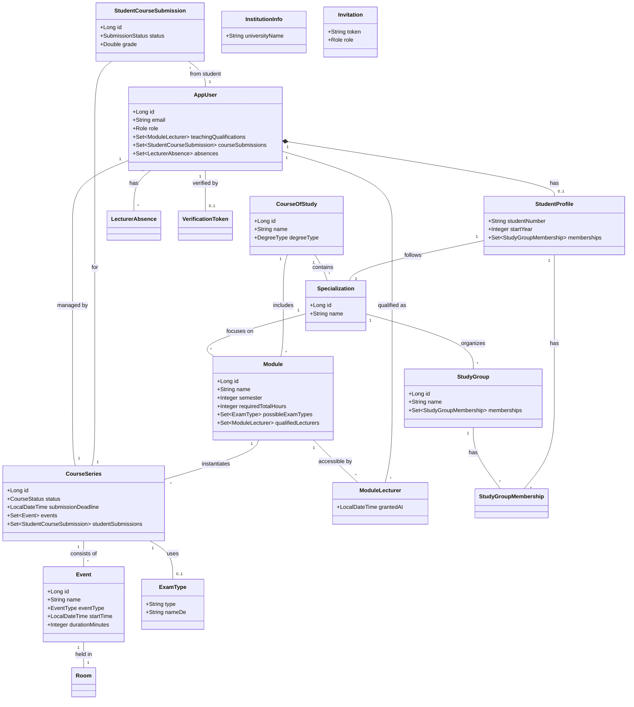

# Architektur-Dokumentation: Campus Plattform JPA-Entitäten

Diese Dokumentation beschreibt die Struktur und das Zusammenspiel der JPA-Entitäten der Campus-Plattform. Sie dient als Leitfaden für Entwickler, um die Beziehungen zwischen Studenten, Dozenten, Modulen und Veranstaltungen zu verstehen.

## 1. Kern-Domain: Benutzer & Gruppen

Die Plattform unterscheidet zwischen administrativen Daten, Lehrinhalten und der konkreten Ausführung von Kursen.

### AppUser (Tabelle: `app_user`)
Zentrale Entität für alle Personen im System (Admins, Dozenten, Studenten).
- **Rollen**: Über das Enum `Role` (ADMIN, LECTURER, STUDENT) gesteuert.
- **Wichtige Beziehungen**:
    - `studentProfile`: Zusatzeigenschaften für Studenten (Matrikelnummer, etc.).
    - `teachingQualifications`: Liste der Module (via `ModuleLecturer`), die dieser User (als Dozent) unterrichten darf.
    - `courseSubmissions`: Erbrachte Leistungen (als Student) in konkreten Kursen.
    - `absences`: Individuelle Abwesenheiten von Dozenten.

### StudentProfile (Tabelle: `student_profile`)
Erweiterung der `AppUser`-Entität für Studenten.
- **Wichtige Beziehungen**:
    - `memberships`: Verknüpfung zu Studiengruppen.
    - `specialization`: Fachliche Vertiefung des Studenten.

### StudyGroup (Tabelle: `study_group`)
Repräsentiert Kursjahrgänge oder studentische Kohorten.
- Studenten sind über `StudyGroupMembership` mit Gruppen verknüpft (via `StudentProfile`).
- Jede Gruppe ist einer `Specialization` zugeordnet.

## 2. Akademische Struktur (Studiengänge, Vertiefungen & Module)

Die Hierarchie stellt sicher, dass Lehrinhalte strukturiert verwaltet werden.

### CourseOfStudy (Tabelle: `course_of_study`)
Repräsentiert einen gesamten Studiengang (z.B. "Informatik").
- **Eigenschaften**: Name und `degreeType` (BACHELOR, MASTER).
- Besitzt mehrere `Specializations`.

### Specialization (Tabelle: `specialization`)
Eine fachliche Vertiefung innerhalb eines Studiengangs.
- Verknüpft Studiengänge mit Modulen und Studenten.

### Module (Tabelle: `module`)
Die "Blaupause" für eine Lehrveranstaltung.
- Definiert das `semester` (Empfehlung), die `requiredTotalHours` und die `possibleExamTypes` (Liste von `ExamType`-Entitäten).
- Ist einem `CourseOfStudy` und optional einer `Specialization` zugeordnet.
- **ModuleLecturer**: Eine explizite Join-Tabelle/Entität, die festlegt, welcher Dozent die Lehrbefähigung für dieses Modul hat (`lecturer_id` + `module_id`).

### ExamType (Tabelle: `exam_type`)
Definiert die Arten der Prüfungen (Klausur, Hausarbeit, etc.).

## 3. Kursplanung & Ausführung (CourseSeries)

Die `CourseSeries` ist die Instanziierung eines Moduls für ein spezifisches Semester oder eine Gruppe.

### CourseSeries (Tabelle: `course_series`)
Die konkrete Durchführung eines Moduls.
- **assignedLecturer**: Der Dozent, der diese spezifische Reihe leitet.
- **status**: PLANNED, ACTIVE oder COMPLETED.
- **selectedExamType**: Die für diesen Kurs gewählte Prüfungsform aus den im Modul erlaubten Optionen.
- **Termine**: Jede Reihe hat mehrere `Event`-Einträge (Einzeltermine).

### Event (Tabelle: `event`)
Ein konkreter Kalendereintrag (Vorlesung, Übung, Klausur).
- Verknüpft eine `CourseSeries` mit einem `Room`.
- Nutzt das Enum `EventType` (LEHRVERANSTALTUNG, KLAUSUR).

## 4. Prüfungs- und Leistungserfassung (Submissions)

Der wichtigste Datenpunkt für Studenten ist die Verknüpfung mit den Ergebnissen.

### StudentCourseSubmission (Tabelle: `student_course_submission`)
Die zentrale Verbindung zwischen einem **Studenten** (`AppUser`) und einer `CourseSeries`.
- **Status**: PENDING, SUBMITTED, GRADED.
- Speichert die `grade` (Note) und Links zu Dokumenten (`documentUrl`).
- Hier wird festgehalten, ob ein Student einen Kurs erfolgreich abgeschlossen hat.

## 5. Abwesenheiten, Räume & Infrastruktur

- **Room**: Speichert `seats` (normale Vorlesung) und `examSeats` (Prüfungsabstand).
- **Abwesenheiten**: `GlobalAbsence` (Sperrzeiten System) und `LecturerAbsence` (Dozenten-Abwesenheiten).
- **InstitutionInfo**: Globale Stammdaten der Universität (Stammdaten, Kontakt, Impressum).
- **Auth & Onboarding**: `Invitation` (Einladungs-Token) und `VerificationToken` (E-Mail/Passwort Sicherheit).

## 6. Datenmodell-Übersicht (UML)

---

### Anzeige-Hinweis (Visualisierung)
Um die obenstehenden Mermaid-Diagramme direkt in VS Code angezeigt zu bekommen: 
1. Installieren Sie die Extension **"Markdown Preview Mermaid Support"**.
2. Öffnen Sie dieses Dokument und drücken Sie die Tastenkombination **`Strg + Umschalt + V`**, um die grafische Vorschau zu öffnen.

### Entwickler-Hinweise:
1. **Kein ManyToMany** (Ausnahme: `Module.possibleExamTypes`): Standardmäßig sollten neue Beziehungen über explizite Join-Tabellen/Entitäten (wie `ModuleLecturer`) gelöst werden, um Metadaten hinzufügen zu können.
2. **Cascade-Rules**: Löschvorgänge bei `AppUser` oder `Module` kaskadieren standardmäßig (`CascadeType.ALL`) auf ihre Join-Tabellen-Einträge, um Datenleichen zu vermeiden.
3. **Naming**: Alle Tabellen nutzen den `snake_case` Standard (z.B. `app_user`), während Java-Klassen `CamelCase` nutzen.
